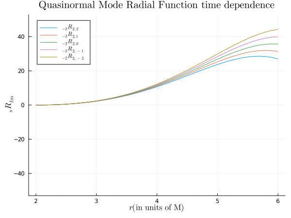

# KerrQuasinormalModes

This is a package that not only computes Quasinormal Modes for Kerr Black holes, but focuses on an easy to use (yet performant) interface for working with the Quasinormal Mode Functions. These functions are basically solutions to the Tuekolsky Equations for different s,l,m,n and a values. We implement the [Cook-Zalutskiy solver](https://arxiv.org/abs/1410.7698) to compute the quasinormal mode frequency and also the radial expansion coefficients, as well as the spectral coefficients in the angular sector. 

## Usage
Start off by defining a `ModeSequence`: this defines a particular mode without reference to a particular $a$ value. Then you can get the QNM wavefunction corresponding to any particular $a$ value. (In this case $a=0.8$)

```julia
Ω = ModeSequence(s=-2,l=2,m=2,n=0) # Pick a mode
ψ = Ω(0.8) # Get the QNM mode function at a = 0.8
```

## Functionality

__QNM Wavefunction values in Boyer Lingquist Coordinates__

```julia
ψ(r) # Returns the value of the radial wavefuntion at r
ψ(r,cos(θ)) # Returns the value of the full wavefunction at r=r, cos(θ)=cos(θ), ϕ=0 and t=0
ψ(r,cos(θ),ϕ) # Returns the value of the full wavefunction at r=r, cos(θ)=cos(θ), ϕ=ϕ and t=0
ψ(r,cos(θ),ϕ,t) # Returns the value of the full wavefunction at r=r, cos(θ)=cos(θ), ϕ=ϕ and t=t
```

__Values for the Quasinormal Mode Quantities__

```julia
ψ.ω # = 0.5860169749084593 - 0.0756295523345646im
ψ.Alm # = 2.5852939720024275 + 0.20529748567633602im
```

__Radial & Spin Weighted Harmonic Wavefunctions__

```julia
ψ.R # Returns the Radial Wavefunction
ψ.R(2.2) # Value of the Radial Wavefunction @ r = 2.2
ψ.R.r₊, ψ.R.r₋  # Radial coordinate of Outer and Inner Horizons
ψ.S # Returns the Spin-Weighted Spheroidal Harmonic Wavefunction
ψ.S(0.7) # Value of the Spin-Weighted Spheroidal Harmonic @ cos(θ) = 0.7
ψ.S(0.7, π/2) # Value of the Spin-Weighted Spheroidal Harmonic @ cos(θ) = 0.7 & ϕ = π/2
ψ.S.Cllʼ # Returns the Spherical-Spheroidal mixing coefficients
```

## Animated Plot of Radial Modes

